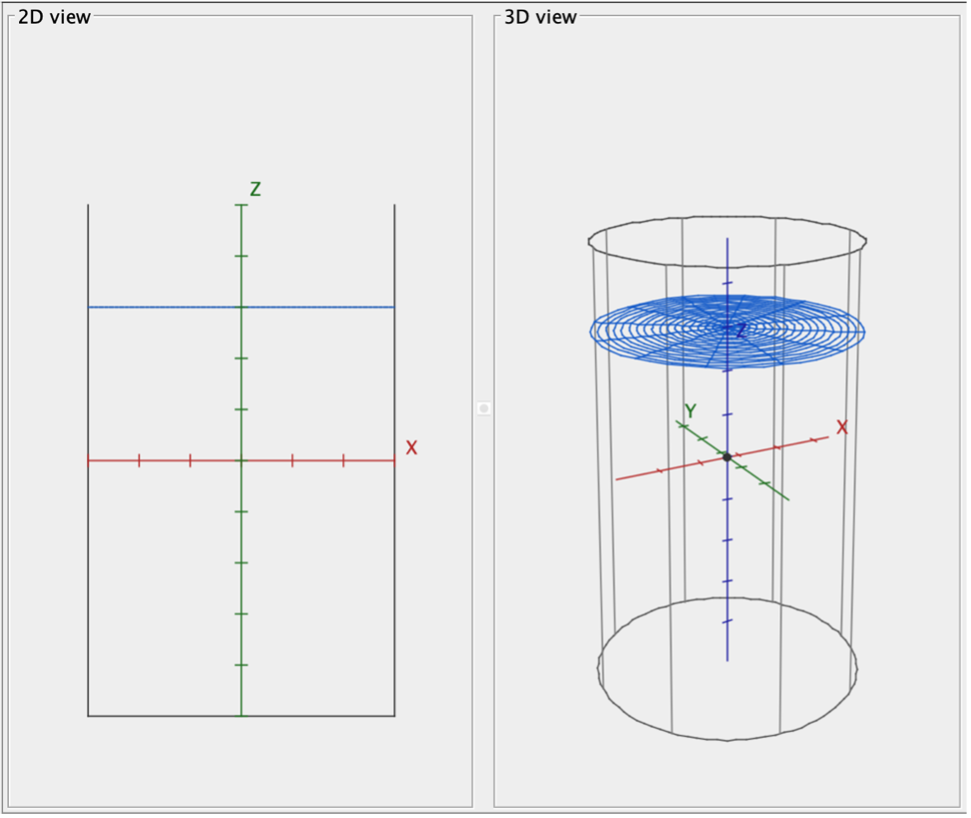
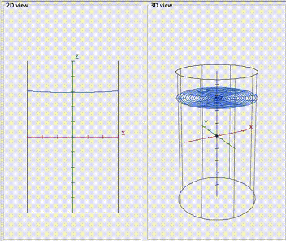

# ODE Spinner


A small Java Swing simulation for a assigment submission that visualizes fluid surface behavior in a rotating cylindrical tank for a ordinary differential equation. 

<table>
	<tr>
		<td align="center"></td>
		<td align="center"><strong>|</strong></td>
		<td align="center"></td>
	</tr>
</table>

## Files
- `TankSimulation.java` - app entry point and UI layout
- `TankModel.java` - model/physics calculations and validation sweep
- `Tank2DPanel.java` - 2D profile rendering
- `Tank3DPanel.java` - interactive 3D mesh rendering

## Build
```bash
mkdir -p bin && javac -d bin *.java
```

## Run
```bash
java -cp bin TankSimulation
```

## Controls
- Drag in 3D view to rotate
- Use `+` and `-` to zoom
- Use the 3D up/down slider
- Toggle axes guides checkbox
- Press `A` to switch mesh color mode
